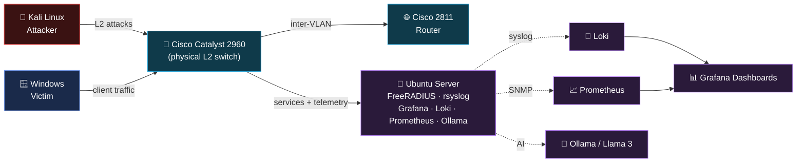
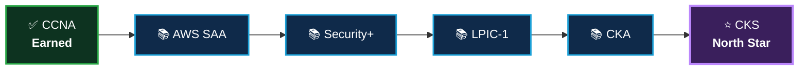

<!-- ╔══════════════════════════════════════════════════════════════════╗ -->
<!-- ║                          HEADER BANNER                            ║ -->
<!-- ╚══════════════════════════════════════════════════════════════════╝ -->

 

 

<!-- ╔══════════════════════════════════════════════════════════════════╗ -->
<!-- ║                       CCNA ACHIEVEMENT                            ║ -->
<!-- ╚══════════════════════════════════════════════════════════════════╝ -->

# 🏆 Cisco Certified Network Associate (CCNA 200-301)

### 📅 Achieved · March 19, 2026

---

<!-- ╔══════════════════════════════════════════════════════════════════╗ -->
<!-- ║                            ABOUT ME                               ║ -->
<!-- ╚══════════════════════════════════════════════════════════════════╝ -->

## 🚀 About Me

I'm a networking and security enthusiast based in **Ho Chi Minh City**, focused on securing infrastructure and understanding real-world protocol behavior. I continuously build lab environments to **simulate attacks, validate configurations, and strengthen defensive network design**.

> 🛡️ **Research Project (NCKH)**  
> *Layered Security Model for Enterprise Access Networks* — an 8-layer Defense-in-Depth architecture validated on physical Cisco Catalyst 2960, with systematic vulnerability exploitation across each layer.

> 🧠 **Documentation**  
> Every lab and research finding is documented in my **[Second Brain](https://github.com/RangoGM/ccna-labs)** repository.

---

<!-- ╔══════════════════════════════════════════════════════════════════╗ -->
<!-- ║                          NOW BUILDING                             ║ -->
<!-- ╚══════════════════════════════════════════════════════════════════╝ -->

## 🔬 Now Building

<table border="0">
  <tr>
    <td align="center" width="50%">
      <b>Devices Observability (Switch/Router)</b>  
      
    </td>
    <td align="center" width="50%">
      <b>Server Observability</b>  
      
    </td>
  </tr>
  <tr>
    <td align="center" width="50%">
      <b>MIMIR Control Plane</b>  
      
    </td>
    <td align="center" width="50%">
      <b>ARGUS Security Auditor</b>  
      <i>Updated later.</i>
    </td>
  </tr>
</table>

---

<!-- ╔══════════════════════════════════════════════════════════════════╗ -->
<!-- ║                         LAB TOPOLOGY                              ║ -->
<!-- ╚══════════════════════════════════════════════════════════════════╝ -->

## 🗺️ Lab Topology

---

<!-- ╔══════════════════════════════════════════════════════════════════╗ -->
<!-- ║                     RESEARCH & PUBLICATIONS                       ║ -->
<!-- ╚══════════════════════════════════════════════════════════════════╝ -->

## 📚 Research & Publications

<i>Updated later.</i>

---

<!-- ╔══════════════════════════════════════════════════════════════════╗ -->
<!-- ║                           TECH STACK                              ║ -->
<!-- ╚══════════════════════════════════════════════════════════════════╝ -->

## 🛠️ Tech Stack & Tools

  <kbd></kbd>
  <kbd></kbd>
  <kbd></kbd>
  <kbd></kbd>
  <kbd></kbd>
  <kbd></kbd>

  <kbd></kbd>
  <kbd></kbd>
  <kbd></kbd>
  <kbd></kbd>
  <kbd></kbd>
  <kbd></kbd>

  <kbd></kbd>
  <kbd></kbd>
  <kbd></kbd>
  <kbd></kbd>
  <kbd></kbd>
  <kbd></kbd>

  <kbd></kbd>
  <kbd></kbd>

---

<!-- ╔══════════════════════════════════════════════════════════════════╗ -->
<!-- ║                         AI MAIN TOOLS                             ║ -->
<!-- ╚══════════════════════════════════════════════════════════════════╝ -->

## 🧠 AI Main Tools

  <kbd></kbd>
  <kbd></kbd>

  
  

---

<!-- ╔══════════════════════════════════════════════════════════════════╗ -->
<!-- ║                         CERTIFICATIONS                            ║ -->
<!-- ╚══════════════════════════════════════════════════════════════════╝ -->

## 📜 Certifications

<table border="0">
  <tr>
    <td align="center" colspan="2" valign="top">
      <a href="https://www.credly.com/badges/cf634bce-0207-4719-bbc9-3a3de93f6471/public_url">
         
        <b>CCNA — Cisco Certified Network Associate</b>
      </a>
    </td>
  </tr>
  <tr>
    <td align="center" width="50%" valign="top">
      <a href="https://www.credly.com/badges/137b8b59-e112-4f64-818f-68e3a5197eb7/public_url">
         
        <b>Networking Basics</b>
      </a>
    </td>
    <td align="center" width="50%" valign="top">
      <a href="https://www.credly.com/badges/8cfb68bb-aace-4849-918a-74b4ed1e3052/public_url">
         
        <b>Networking Devices Initial Configuration</b>
      </a>
    </td>
  </tr>
  <tr>
    <td align="center" width="50%" valign="top">
      <a href="https://www.credly.com/badges/ebf156c7-193f-4758-8c67-5c89f9d92c70/public_url">
         
        <b>Network Addressing Troubleshooting</b>
      </a>
    </td>
    <td align="center" width="50%" valign="top">
      <a href="https://www.credly.com/badges/05a881bd-d6f9-4242-a03f-47245d3cf7f1/public_url">
         
        <b>Network Support &amp; Security</b>
      </a>
    </td>
  </tr>
</table>

---

<!-- ╔══════════════════════════════════════════════════════════════════╗ -->
<!-- ║                     CERTIFICATION ROADMAP                         ║ -->
<!-- ╚══════════════════════════════════════════════════════════════════╝ -->

## 🎯 Certification Roadmap

<table>
  <tr>
    <td>🟢 <b>Earned</b></td>
    <td>CCNA — Cisco networking foundation</td>
  </tr>
  <tr>
    <td>📚 <b>Planned</b></td>
    <td>Cloud · Security baseline · Linux · Kubernetes admin</td>
  </tr>
  <tr>
    <td>⭐ <b>North Star</b></td>
    <td>CKS — capstone for the DevSecOps path</td>
  </tr>
</table>

<i>Sequence reflects intended order, not committed dates.</i>

---

<!-- ╔══════════════════════════════════════════════════════════════════╗ -->
<!-- ║                         GITHUB STATS                              ║ -->
<!-- ╚══════════════════════════════════════════════════════════════════╝ -->

## 📊 GitHub Activity

<table border="0">
  <tr>
    <td colspan="2" align="center">
      
    </td>
  </tr>
  <tr>
    <td align="center" width="50%">
      
    </td>
    <td align="center" width="50%">
      
    </td>
  </tr>
  <tr>
    <td align="center" width="50%">
      
    </td>
    <td align="center" width="50%">
      
    </td>
  </tr>
  <tr>
    <td colspan="2" align="center">
      
    </td>
  </tr>
</table>

---

<!-- ╔══════════════════════════════════════════════════════════════════╗ -->
<!-- ║                            CONNECT                                ║ -->
<!-- ╚══════════════════════════════════════════════════════════════════╝ -->

## 📍 Current Base & Connect

 

  <i>"Build labs. Break things. Document everything."</i>

 

